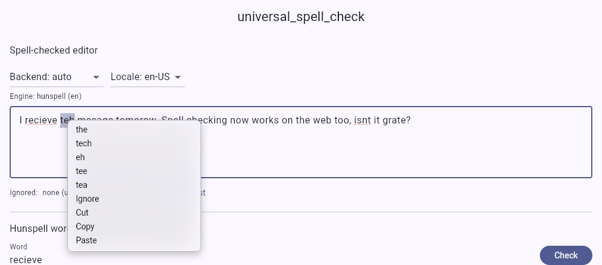

# universal_spell_check

Spell checking for Flutter `TextField`s on **every** platform.



Flutter's built-in spell check (`SpellCheckConfiguration` +
`DefaultSpellCheckService`) only works on Android and iOS. Web, macOS,
Windows and Linux get nothing. This is
[flutter/flutter#40682](https://github.com/flutter/flutter/issues/40682).
This package adds a `SpellCheckService` that works on all six platforms and
plugs straight into the existing Flutter API.

| Platform | Engine | Notes |
|----------|--------|-------|
| Android | Flutter `DefaultSpellCheckService` | Uses the system spell checker service |
| iOS | Flutter `DefaultSpellCheckService` | Uses `UITextChecker` |
| macOS 10.15+ | `NSSpellChecker` (Swift) | Every language macOS has a dictionary for |
| Windows 8+ | `ISpellChecker` (C++) | Every language pack installed on Windows |
| Linux | Enchant-2 (C), loaded with `dlopen` | Needs `libenchant-2-2` plus e.g. `hunspell-en-us`. Without them it reports *unavailable* and does not crash |
| Web | Pure-Dart Hunspell engine | Bundled en_US dictionary. Any other Hunspell dictionary can be loaded from assets or a URL |

With the default `SpellCheckBackend.auto`, a desktop OS that cannot check a
locale falls back to the Hunspell engine if a dictionary exists for it
(en_US ships in the package).

## Install

```yaml
dependencies:
  universal_spell_check: ^0.1.0
```

## Usage

```dart
import 'package:universal_spell_check/universal_spell_check.dart';

TextField(
  spellCheckConfiguration: UniversalSpellCheck.configuration(),
  // Right-click (desktop/web) or long-press menu with suggestions + "Ignore":
  contextMenuBuilder: UniversalSpellCheck.contextMenuBuilder,
)
```

On the web, call this once at startup so right-click opens Flutter's menu
(with suggestions) and not the browser's:

```dart
await UniversalSpellCheck.useFlutterContextMenuOnWeb();
```

### Using only the service

```dart
TextField(
  spellCheckConfiguration: SpellCheckConfiguration(
    spellCheckService: UniversalSpellCheckService.instance,
    misspelledTextStyle: UniversalSpellCheck.misspelledTextStyle,
  ),
)
```

### Options

```dart
final service = UniversalSpellCheckService(
  backend: SpellCheckBackend.auto,      // auto | native | hunspell
  hunspellDictionaries: {
    'en': const HunspellSource.bundledEnUS(),
    'de': const HunspellSource.asset('assets/de_DE.aff', 'assets/de_DE.dic'),
    'fr': HunspellSource.url(Uri.parse('https://example.com/fr.aff'),
                             Uri.parse('https://example.com/fr.dic')),
  },
  maxSuggestions: 5,
  useIsolate: true,                     // Hunspell off the UI isolate (native)
  ignoredWords: ['Flutter'],
);

await service.availability(const Locale('de', 'DE')); // which engine, which dictionary
await service.warmUp(const Locale('en', 'US'));        // parse the dictionary early
service.ignoreWord('Manish');
```

Create a service once, for example in a `State` or as a global. Do not create
one inside `build()`.

### The Hunspell engine on its own

```dart
final dict = HunspellDictionary.parse(affText, dicText);
final hunspell = Hunspell(dict);
hunspell.check('colour');          // false with en_US
hunspell.suggest('recieve');       // [receive, relieve]

final checker = HunspellSpellChecker(const HunspellSource.bundledEnUS());
await checker.check('I recieve teh mail'); // List<SpellCheckRange>
```

Supported `.aff` features: `SET`, `FLAG` (char/long/num/UTF-8), `AF`,
`PFX`/`SFX` (conditions, strip, cross product, continuation classes), `TRY`,
`KEY`, `REP`, `MAP`, `ICONV`/`OCONV`, `KEEPCASE`, `NOSUGGEST`,
`FORBIDDENWORD`, `NEEDAFFIX`, `ONLYINCOMPOUND`, `COMPOUNDRULE`,
`COMPOUNDMIN`, `WORDCHARS`, `BREAK`.

## Limitations

- **Web:** browsers give web apps no way to query their own spell checker,
  so the web uses the bundled Hunspell engine. Dart on the web has no
  isolates, so the engine runs on the main thread and yields between chunks
  of work. Parsing en_US takes a few hundred milliseconds, once. The
  dictionary adds about 540 KB to the web build (about 190 KB gzipped).
- **Desktop suggestions:** Flutter itself only opens its spell-check toolbar
  when you tap a word on Android/iOS. On desktop and web, use
  `contextMenuBuilder` (right-click) to show suggestions.
- **Hunspell coverage:** there is no morphological analysis, no
  `COMPOUNDFLAG`-style compounding (only `COMPOUNDRULE`), no `CHECKSHARPS`
  and no `PHONE` table. The order of suggestions can differ from C Hunspell.
  en_US is fully supported.
- **Ignore list:** it lasts for the session only, and it is not written to
  the OS dictionary.
- **Screenshots:** the example's `integration_test/screenshot_test.dart`
  regenerates the macOS images from the real `NSSpellChecker`.
- **Windows/Linux:** the native code is written against the documented
  APIs, but this release was built and run only on macOS and the web. The
  Linux C code was syntax-checked against real GLib headers.

## Dictionary license

`dictionaries/en_US.*` comes from SCOWL (wordlist.aspell.net, 2020.12.07,
size 60) and uses its own permissive license, in
[`dictionaries/LICENSE-en_US.txt`](dictionaries/LICENSE-en_US.txt). The
package code is MIT.
